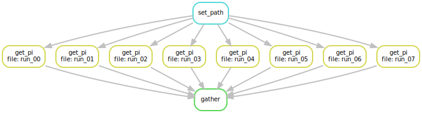

# Estimate pi using Snakemake

This is an example of a Snakemake workflow. 
The workflow makes sure that:

1. A folder called `results/` is created.
2. The files in `input/` are processed.
3. The average of all results is calculated.

## Dependency diagram



Dependency diagrams can be generated by:

```bash
snakemake --forceall --dag | dot -Tsvg > diagram.svg
```

## Purpose

The purpose of this project is purely pedagogical.
We want to show a workflow that processes a set of input files (in our case, text files containing a single integer), generates a set of output files, and performs a latter analysis over those files.
This kind of workflows are very common in research.

For those readers who feel curiosity, our processing of each individual file consists on:

1. Reading an integer (N) from each input file.
2. Simulating N random impacts on a 1 x 1 square.
3. Counting how many of those random impacts happened inside a circle of radius 1 (M).
4. Estimating the value of pi as 4 * M / N (see why [here](https://blog.esciencecenter.nl/parallel-programming-in-python-7fd62c90217d)).
5. Storing this value in an output file.

The processing of these files is an example of an [embarrasingly parallel problem](https://en.wikipedia.org/wiki/Embarrassingly_parallel).

We can run this workflow in parallel for, say, 8 cores, using:

```bash
snakemake -j8
```
